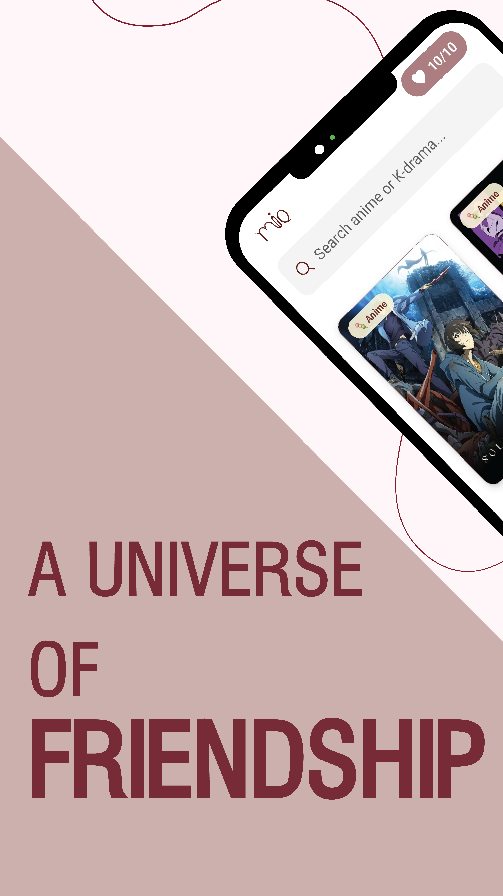
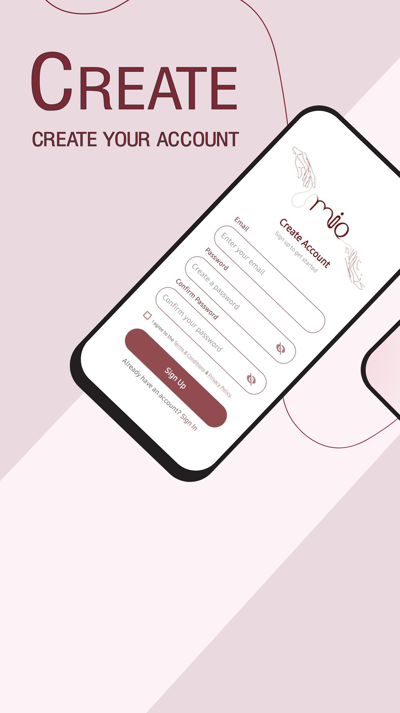
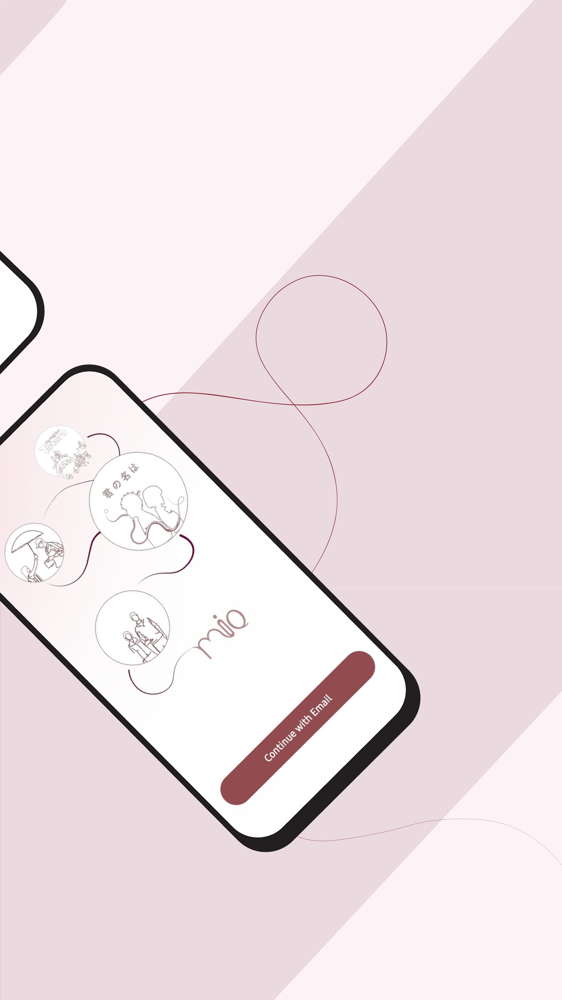
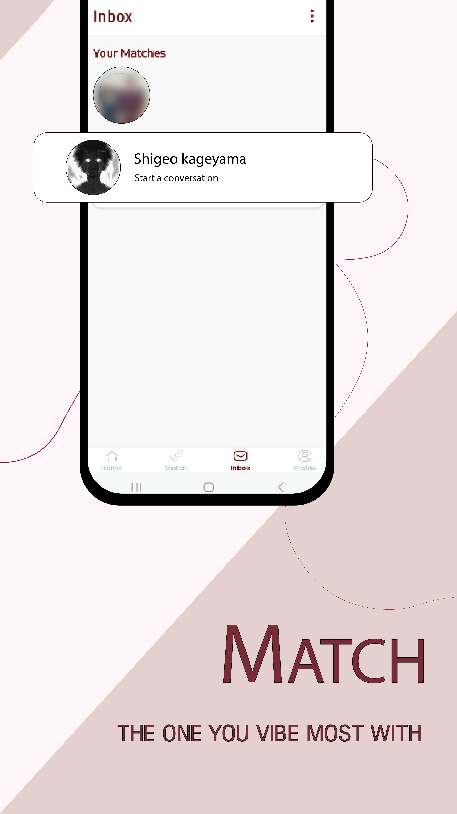

# Mio App

A mobile application built with React Native and Expo that matches users based on their favorite anime and K-drama shows. Mio creates connections between users with similar entertainment preferences, allowing them to chat and form relationships around their common interests.


## 📥 Download Now


👉 [Get Mio on Google Play Store](https://play.google.com/store/apps/details?id=com.mioapp.social&pli=1)


## 📱 App Preview


A quick look at the Mio App interface:

<p align="center">
  
  
  
  
  
  
</p>


## 🚀 Features

### 🔐 Authentication
- Secure login and registration using **email/password**
- **Google Sign-In** integration

### 👤 Profile Management
- Create and customize personal profiles
- Upload a **profile picture**
- Manage personal info and favorite shows
- **Delete your account** permanently

### 🎯 Show Discovery & Matching
- Browse **trending Anime** and **K-Drama** shows
- Add up to **10 favorite shows**
- **Weekly cooldown** to remove shows
- **Smart Matching Algorithm** to pair users based on shared interests
- Match types:
  - 🔵 **Match** – moderate common interests  
  - 🟣 **Super Match** – high commonality

### 💬 Real-time Chat
- Chat system for matched users
- Messages stored in **Firebase Firestore**
- **Chats auto-archived** to Firebase Storage after inactivity (via Cloud Functions)
- Users can **delete individual chats**

### 🔒 Safety Tools
- **Block or unmatch** any user
- **Report** inappropriate accounts

### 🚨 Notifications
- **Real-time notifications** when a match is found
- Built using **Firebase Cloud Messaging (FCM)**
- Works across devices to ensure instant updates


## Technologies Used

- **Frontend**:
  - React Native / Expo
  - TypeScript
  - Expo Router for navigation
  - React Context for state management
  
- **Backend**:
  - Firebase Authentication
  - Firestore Database
  - Firebase Cloud Functions
  - Firebase Storage
  
- **External APIs**:
  - TMDB (The Movie Database) API for show information
  - Cloudinary for image storage and management

## Getting Started

### Prerequisites

- Node.js (v16 or newer)
- npm or yarn
- Expo CLI (`npm install -g expo-cli`)
- Firebase account
- TMDB API key
- Cloudinary account

### Installation

```bash
# Clone the repository
git clone https://github.com/yourusername/Mio-App.git

# Navigate to the project directory
cd Mio-App

# Install dependencies
npm install

# Start the development server
npx expo start
```

### Environment Setup

Create a `.env` file in the root directory with the following configurations:

```
# Firebase configuration
EXPO_PUBLIC_FIREBASE_API_KEY=your-firebase-api-key
EXPO_PUBLIC_FIREBASE_AUTH_DOMAIN=your-firebase-auth-domain
EXPO_PUBLIC_FIREBASE_PROJECT_ID=your-firebase-project-id
EXPO_PUBLIC_FIREBASE_STORAGE_BUCKET=your-firebase-storage-bucket
EXPO_PUBLIC_FIREBASE_MESSAGING_SENDER_ID=your-firebase-messaging-sender-id
EXPO_PUBLIC_FIREBASE_APP_ID=your-firebase-app-id

# TMDB API
EXPO_PUBLIC_TMDB_API_KEY=your-tmdb-api-key

# Cloudinary
EXPO_PUBLIC_CLOUDINARY_CLOUD_NAME=your-cloudinary-cloud-name
EXPO_PUBLIC_CLOUDINARY_UPLOAD_PRESET=your-cloudinary-upload-preset
```

### Firebase Setup

1. Create a Firebase project at [https://console.firebase.google.com/](https://console.firebase.google.com/)
2. Enable Authentication (Email/Password)
3. Create a Firestore database
4. Set up Firebase Storage
5. Deploy the Cloud Functions in the `functions` directory:

```bash
cd functions
npm install
firebase deploy --only functions
```

## Deployment

### Building for Android

```bash
# Push environment variables to EAS
eas secret:push --scope project --env-file ./.env --force

# Build a preview version
eas build --platform android --profile preview

# Build a production version
eas build --platform android --profile production
```

### Building for iOS

```bash
# in development
```

### Updating an Existing Build

```bash
# Update the preview channel
eas update --branch preview

# Update the production channel
eas update --branch production
```

## Project Structure

```
Mio/
├── app/ - Main application screens and navigation
│   ├── (admin)/ - Admin-only screens
│   ├── (auth)/ - Authentication screens
│   ├── (common)/ - Common screens like series details
│   ├── (conversations)/ - Chat and messaging screens
│   ├── (tabs)/ - Main tab screens (home, inbox, profile)
├── assets/ - Images, fonts and other static assets
├── components/ - Reusable UI components
├── config/ - Configuration files (Firebase, Cloudinary)
├── constants/ - App constants and theme settings
├── context/ - React Context providers
├── functions/ - Firebase Cloud Functions
│   ├── src/
│   │   ├── index.ts - Cloud functions definitions
├── hooks/ - Custom React hooks
├── utils/ - Utility functions
```

## Firebase Functions

The app uses several Firebase Cloud Functions:

- `scheduleMessageArchiving`: Daily cron job for archiving old messages
- `manualArchiveMessages`: Administrative function for manual archive triggering
- `deleteConversationData`: Removes conversation data when users unmatch or block

## License

MIT 

## Contact for More Details

- 📧 Email: [oitijya2002@gmail.com](mailto:oitijya2002@gmail.com)  
- 🔗 LinkedIn: [Oitijya Islam Auvro](https://linkedin.com/in/oitijya-islam-auvro-a252a5325)  
- 💻 GitHub: [AuvroIslam](https://github.com/AuvroIslam)  

